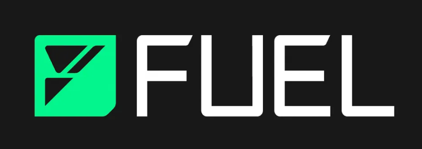

# awesome-sway-security 

Sway is a domain-specific programming language designed for implementing smart contracts on blockchain platforms, most notably for the Fuel  Virtual Machine (Fuel VM). It is heavily inspired by Rust's approach to  systems programming and aims to bring modern programming language  features and tooling to smart contract development. Sway focuses on  performance, fine-grained control, and extensive use of static analysis  to prevent common security issues.

## 🔐 Sway Language Security

* [Introduction to Sway Language Security Audit](https://exvul.com/introduction-to-the-sway-language-security-audit/) – An introduction to the security audits of Sway language in the Fuel ecosystem.

## 💡 Contribution

We welcome contributions from the community! If you have valuable  resources to add or improvements to suggest, feel free to raise a Pull  Request (PR).

1. **Fork the repository.**
2. **Create a new branch** (`git checkout -b feature/YourFeature`).
3. **Commit your changes** (`git commit -m 'Add some feature'`).
4. **Push to the branch** (`git push origin feature/YourFeature`).
5. **Open a Pull Request**.